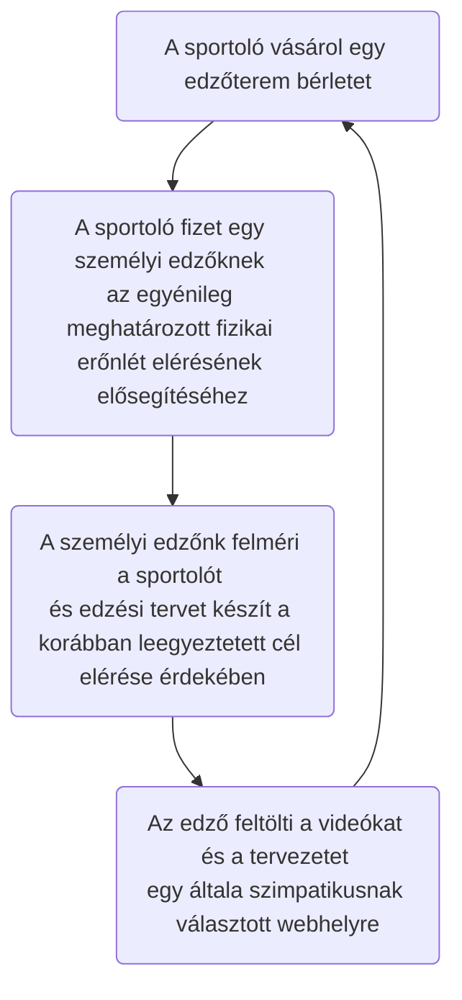
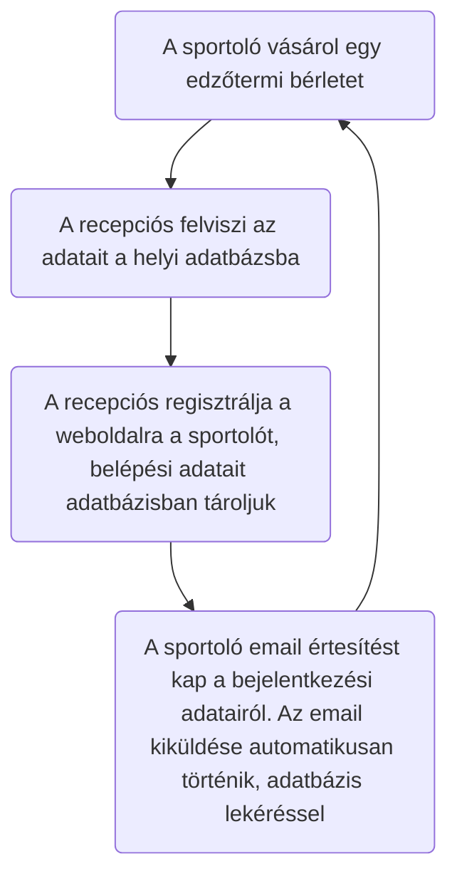

# Funkcionális Specifikáció

## 1.A Rendszer céljai és nem céljai

Az új rendszer fejlesztésének a célja, hogy a megrendelő vállalkozása adminisztratív szempontból sokkal jobban átláthatóbb legyen mint a jelenlegi rendszer, ahol csak lokális adatbázis létezett illetve informatív legyen az új webfelület által.
Az érvényes bérlettel rendelkező sportolók, akik regisztráltak a weboldalra, azok számára elérhető lesz a weboldal tartalma, ahol képek, videók illetve a legújjabb trendek jelennek majd meg.
A tulajdonos illetve a rendszer fő adminisztrátora teljes körű jogosultságot kap ami azt jelenti, hogy ők képesek lesznek az adatbázisba adatot felvinni, töröli, módosítani illetve lekérni. 
A recepciós munkakörben dolgozók új sportolót tudnak majd felvinni illetve azok adatait tudják majd módosítani. a megrendelő. Ha későbbiekben igény merülne fel egyes recepciós jogkörének a módosítására akkor az későbbiekben is megoldható.
A terembe járó sportolók az adatbázis szemszögből csak a felhasználó nevüket illetve az e-mail címüket illetve a jelszavukat tudják felvinni a rendszerbe.
A rendszernek nem célja, hogy bárki számára elérhető legyen az oldal tartalma, mert a tulajdonos ezt a plusz szolgáltatás csakis az érvényes bérlettel rendelkező tagok számára teszi elérhetővé.

## 2. Használati esetek

A rendszer használói a következők: 
*	havi vagy éves bérlettel rendelkező sportoló
*	dolgozó 
*	adminisztrátor

A rendszernek a következő funkciókat kell ellátnia:
*	az adminisztrátorok tudjanak dolgozókat regisztrálni és törölni
*	dolgozók tudjanak sportolókat regisztrálni

Előfeltételek:
*	adminisztrátoroknak, sportolóknak, a dolgozóknak a rendszer használatához felhasználónév és jelszó szükséges

## 3. Megfeleltetés a követelmények és a használati eseteknek

A K01,K02,K03: A weboldal úgy lesz kialakítva, hogy a rendszer bármely szereplője csakis regisztráció után érje el az oldal tartalmát. 
K04: Az adminisztrátor regisztrálhat, módosíthat, törölhet dolgozót és sportolót, a dolgozó regisztrálhat, módosíthat sportolót, de nem törölheti azt. A sporoló dolgozói vagy adminisztrátori regisztráció után regisztrálhatja magát és itt megadhatja a saját felhasználó nevét, jelszavát e-mail címét.
K05: Weboldalon az admin jogosultsági szinten lévő személynel lehetősége lesz a rendszer bármely szereplőének a jogosultsági szint egyszerű beállítására, módosítására.
A K06,K07,K08: A weboldalon lehetőség lesz szöveg, kép illetve videó feltöltése
K09: A weboldalon meg fog jelenni mindíg az aktuális árlista. 
K10: A weboldalon lehetőség nyílik különböző sporttal kapcsolatos tartalom elérése, megtekintése

Jelenlegi üzleti folyamatok

### Adatbázis szemszögből

## 4. Képernyőtervek

A látványterveket [itt](https://github.com/AfpGroupE/sport/tree/main/sport-oldal/docs/L%C3%A1tv%C3%A1nyterv) meglehet tekinteni.

Weboldal lapjai bejelentkezés nélkül:
- **Főoldal**, amely weboldal látogatásakor először jelenik meg.  

- **Kapcsolatok**, ahol az elérhetőségeket lehet megtekinteni (e-mail, telefon, cím, közösségi oldalak).  

- **Regisztráció**, ahol regisztrálhatja magát a felhasználó.

- **Bejelentkezés**, ahol bejelentkezés után a többi menüpont is elérhetővé válik jogosultsági szinttől függően.

A rendszerbe háromféle felhasználói jogosultsággal lehet belépni: felhasználó, alkalmazott és adminisztrátor. Az adminisztrátor jogosultságai megegyeznek az alkalmazott és a felhasználó jogosultságaival is. Az alkalmazott jogosultságai azonosak a felhasználó jogosultságaival. Tehát az adminisztrátor teljes hozzáférést biztosít a rendszerhez, míg az alkalmazott és a felhasználó csak az őket illető tevékenységeket végezhetik el.

Többi oldal:
- **Galéria**
- **Videók**
- **Árlista**
- **Étrendek**
- **Edzéstervek**
- **Hírek**
- **Felhasználók**
- **Alkalmazottak**
- **Kijelentkezés**

## 5. Forgatókönyvek

- **Felhsználó:**
Sikeres regisztráció és bejelentkezés után a felhasználó számára elérhetővé válnak a Galéria, Videók, Árlista, Étrendek, Edzéstervek, Hírek, Kijelentkezés menüpontok.
    - Galéria: a képek között lehet böngészni.
    - Videók: a videók között lehet böngészni.
    - Árlista: a felhasználó tud egy havi és egy éves bérlet közül választani.
    - Étrendek: az étrendek között lehet böngészni.
    - Edzéstervek: a felhasználó az edzésterveit tudja megtekinteni, leírások vannak a gyakorlatokhoz és videók.
    - Hírek: legfrissebb hírek közül lehet böngészni.

- **Alkalmazott:**
    Az alkalmazotti bejelentkezés annyiban tér el a felhasználói bejelentkezéstől, hogy az alkalmazottnak megjelenik pluszban a "Felhasználók" menüpont ahol új felhasználót tud felvenni az adatbázisba, valamint tud törölni, szerkeszteni meglévőket. Keresési funkcióval tud felhasználók között szűrni.
    - Az alkalmazottaknak van még lehetőségük:
        - Galéria: Képeket feltölteni és törölni
        - Videók: Videókat feltölteni és törölni
        - Étrendek: Receptet törölni, új receptet felvenni vagy meglévőt módosítani. Recepteknél szükséges a recept címe, szövege és egy kép.
        - Edzéstervek: Edzést törlölni, új edzést létrehozni vagy meglévőt módosítása. Edzés tervnél meg kell adni a címét, az edzés szövegét és egy képet/videót.
        - Hírek: Híreket írni, módosítani, törölni. Hír írásakor meg kell adni a hír címét, szerzőt, hír szövegét és egy képet vagy videót. A dátum automatikusan generálódik.

 - **Admin:**
    Az adminnak mindenhez van jogosultága ami az alkalmazottnak van. Az admin az alkalmazottak adatbázisához is van hozzáférése az "Admin"->"Alkalmazottak" menüpontban. Itt tud új alkalmazottat regisztrálni, törölni, szerkeszteni meglévő adatokat és keresni.

## 6. Funkció–követelmény megfeleltetés
ID|Verzió|Követelmény|Funkció
--|------|---|--------
K01|V1.0|Alkalmazottak adminisztrációja|Alkalmazottak regisztrálása, törlése és adataik módosítása, amit az amdinok végezhetnek a használati esetekben leírtak szerint.  
K02|V1.0|Felhasználók adminisztrációja|Felhasználók regisztrálása és törlése, amit az adminok és alkalmazottak végezhetnek a használati esetekben leírtak szerint.
K03|V1.0|Felhasználói és alkalamzott fiókok kezelése|A felhasználók bejelentkezésének kezelése és a felhasználói adatok módosításának lehetőségének biztosítása. Felhasználók és alkalmazottak regisztrálása, törlése és adataik módosítása, amit az admin végezhet.  
K04|V1.0|Kezelőfelület|A felhasználói felület megvalósítása szabványos html, css és React(javascript) technológiák felhasználásával, a képernyőtervek részben található.