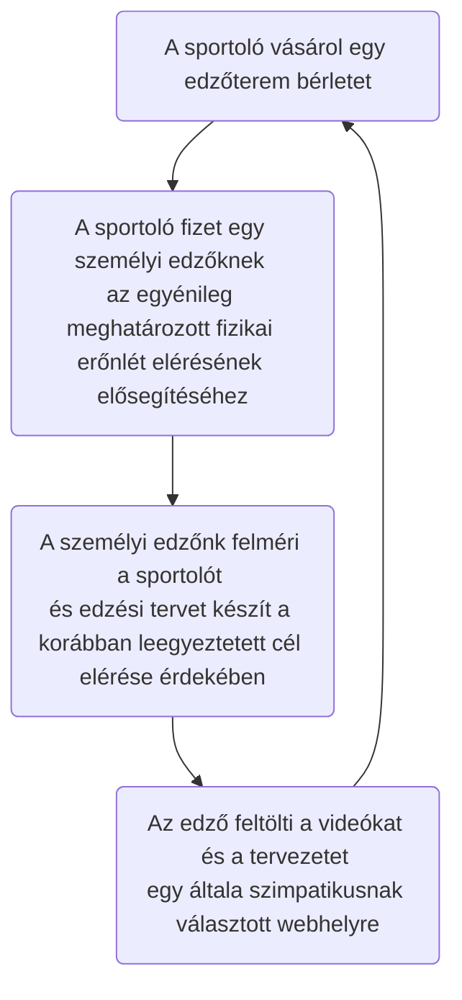
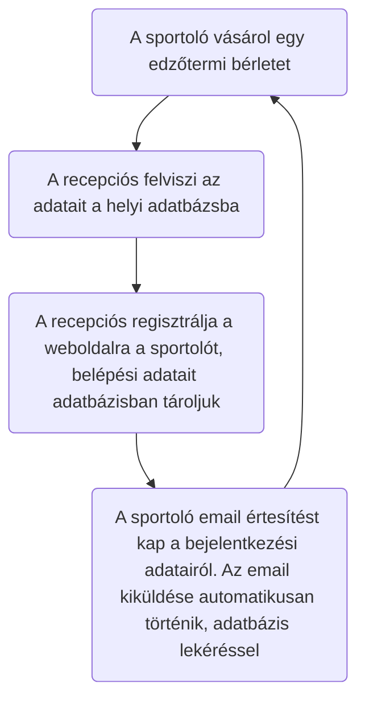

# Funkcionális Specifikáció

## 1.A Rendszer céljai és nem céljai

Az új rendszer fejlesztésének a célja, hogy a megrendelő vállalkozása adminisztratív szempontból sokkal jobban átláthatóbb legyen mint a jelenlegi rendszer, ahol csak lokális adatbázis létezett illetve informatív legyen az új webfelület által.
Az érvényes bérlettel rendelkező sportolók, akik regisztráltak a weboldalra, azok számára elérhető lesz a weboldal tartalma, ahol képek, videók illetve a legújjabb trendek jelennek majd meg.
A tulajdonos illetve a rendszer fő adminisztrátora teljes körű jogosultságot kap ami azt jelenti, hogy ők képesek lesznek az adatbázisba adatot felvinni, töröli, módosítani illetve lekérni. 
A recepciós munkakörben dolgozók új sportolót tudnak majd felvinni illetve azok adatait tudják majd módosítani. a megrendelő. Ha későbbiekben igény merülne fel egyes recepciós jogkörének a módosítására akkor az későbbiekben is megoldható.
A terembe járó sportolók az adatbázis szemszögből csak a felhasználó nevüket illetve az e-mail címüket illetve a jelszavukat tudják felvinni a rendszerbe.
A rendszernek nem célja, hogy bárki számára elérhető legyen az oldal tartalma, mert a tulajdonos ezt a plusz szolgáltatás csakis az érvényes bérlettel rendelkező tagok számára teszi elérhetővé.

## 2. Használati esetek

A rendszer használói a következők: 
*	havi vagy éves bérlettel rendelkező sportoló
*	dolgozó 
*	adminisztrátor

A rendszernek a következő funkciókat kell ellátnia:
*	az adminisztrátorok tudjanak dolgozókat regisztrálni és törölni
*	dolgozók tudjanak sportolókat regisztrálni

Előfeltételek:
*	adminisztrátoroknak, sportolóknak, a dolgozóknak a rendszer használatához felhasználónév és jelszó szükséges

## 3. Megfeleltetés a követelmények és a használati eseteknek

A K01,K02,K03: A weboldal úgy lesz kialakítva, hogy a rendszer bármely szereplője csakis regisztráció után érje el az oldal tartalmát. 
K04: Az adminisztrátor regisztrálhat, módosíthat, törölhet dolgozót és sportolót, a dolgozó regisztrálhat, módosíthat sportolót, de nem törölheti azt. A sporoló dolgozói vagy adminisztrátori regisztráció után regisztrálhatja magát és itt megadhatja a saját felhasználó nevét, jelszavát e-mail címét.
K05: Weboldalon az admin jogosultsági szinten lévő személynel lehetősége lesz a rendszer bármely szereplőének a jogosultsági szint egyszerű beállítására, módosítására.
A K06,K07,K08: A weboldalon lehetőség lesz szöveg, kép illetve videó feltöltése
K09: A weboldalon meg fog jelenni mindíg az aktuális árlista. 
K10: A weboldalon lehetőség nyílik különböző sporttal kapcsolatos tartalom elérése, megtekintése

Jelenlegi üzleti folyamatok

### Adatbázis szemszögből

