# Követelmény Specifikáció

## 1.Jelenlegi helyzet

A cégünket megbízó sport vállalkozás Magyarországon közel 30 edzőtermet üzemeltet.
Cégünket a partner azzal szándékkal kereste meg, hogy készítsünk neki egy olyan weboldalt, ahol az általuk elkészített edzésterveket, híreket és videólinkeket, fel tudják tölteni. 
Mivel a megrendelő foglalkoztat dietetikusokat is, így a táplálkozástudomány szakterület is helyet kapna a weboldalon.
Az elmúlt években többször is be kellett zárni az edzőtermeket, így sokan arra kényszerültek, hogy otthon edzhessenek segítség nélkül.
Jelenleg az általunk foglalkoztatott személyi edzők különböző felületen osztják meg a sportolóikkal az edzésterveiket, diétás tanácsaikat, amely sokszor a sportolónak nem mindig egyértelmű, hogy hová kell kattintani.
Időközben igény merült fel az edzőterembe járó sportolók adatainak egy központi adatbázisba való tárolására is. 
A megrendelő egy olyan komplex weboldalt szeretne a cégünkkel megcsináltatni, amely a sportolói, tulajdonosi, illetve adminisztrációs igényeket tud kielégíteni.

## 2.Vágyálomrendszer leírása

A megrendelőnek a fejlesztendő weboldallal az a célja, hogy a vállalkozásának a szolgáltatási színvonalát javítsa, illetve az általa foglakoztatott személyi edzők számát redukálja, mert az élő munkára rakódó közteher évről évre nő és ezáltal szeretné a költségeit csökkenteni, optimalizálni.
A költségoptimalizáció mellett fontos a náluk sportoló vendégek megbízható forrásból származó információval való ellátása is.
A bejelentkezés után a felhasználó rögtön egy igényes webfelülettel találkozna számos navigációs lehetősséggel.

- Főmenü
- Hírek képekkel, és videokkal
- Edzéstervek
- Táplálkozási tanácsok
- Árlista
- Galéria
- Csapat
- Kapcsolat
- Be és kijelentkezés

Az edzők és a rendszergazdák számára lehetőséget biztosítanák videólinkek, képek és hírek feltöltésére és módosítására. 
Mivel a megrendelő számos edzőtermet üzemeltet, így szeretne egy központi adatbázist is létrehozni azzal a szándékkal, hogy 
aki érvényes bérlettel rendelkezik ne csak ott tudjon edzni, ahol kiváltotta a bérletet, hanem a cég összes edzőtermében.
Illetve a megrendelő szeretné a cégük alkalmazásában álló munkavállalók,
és az edzőterembe látogató vendégek (sportolók) adatait tarolni a fejlesztendő alkalmas adatbázisában.

## 3. A rendszerre vonatkozó szabályok

* General Data Protection Regulation (Általános adatvédelmi rendelet)

**Európai uniós rendeletek, irányelvek, ajánlások**

*AZ EURÓPAI PARLAMENT ÉS A TANÁCS (EU) 2019/790 IRÁNYELVE (2019. április 17.)* a digitális egységes piacon a szerzői és szomszédos jogokról, valamint a 96/9/EK és a 2001/29/EK irányelv módosításáról

*AZ EURÓPAI PARLAMENT ÉS A TANÁCS (EU) 2016/679 RENDELETE (2016. április 27.)* a természetes személyeknek a személyes adatok kezelése tekintetében történő védelméről és az ilyen adatok szabad áramlásáról,

*2014/26/EU európai parlamenti és tanácsi irányelv* a szerzői és szomszédos jogokra vonatkozó közös jogkezelésről és a zeneművek belső piacon történő online felhasználásának több területre kiterjedő hatályú engedélyezéséről szóló 2014. február 26-i A Bizottság 2012/417/EU (2012. július 17.) ajánlása a tudományos információkhoz való hozzáférésről és azok megőrzéséről

*2012/417/EU (2012. július 17.)* ajánlása a tudományos információkhoz való hozzáférésről és azok megőrzéséről;

*96/9/EK irányelv* (1996. március 11.) az adatbázisok jogi védelméről

## 4. Jelenlegi üzleti folyamatok modellje

Üzleti szereplők: 	
-	vendég (sportoló)

Üzleti munkatárs: 	
-	gym center alkalmazottati(személyi edzők, dietetikusok, edzőterem tulajdonosai)

Üzleti entitások: 		
-	bérlet
-	nyilvántartás a vendégekről (személyes adatok, bérlet típusa, érvényessége) (Excel táblázat)
-	nyilvántartás gym center alkalmazottairól (Excel táblázat)
-	nyilvántartás személyi edzők beosztásáról (Excel táblázat)
-	edzéstervek listája (Word dokumentum)
-	táplálkozási tanácsok listája (Word dokumentum)
-	internetes közössági felületek (Facebook, Facebook Messenger, YouTube, WhatsApp, Instagram, stb.)
-	árlista a szolgálatásokról (Word dokumentum)

Üzleti folyamatok:
-	Új alkalmazott felvétele: alkalmazott személy adtok beírása a nyilvántartásba (Gym center ügyvezetői végzik) (Név, lakcím, telefonszám, lakcím, születési dátum, munkakör).
-	Új vendég felvétele: vendég beírása a nyilvántartásba (Gym center alkalmazottak végzik) (Név, lakcím, telefonszám, lakcím, születési dátum) => bérlet kiállítása átadása => bérlet típus, érvényesség felvitele a nyilvántartásba.		
-	Személyi edző foglalás: vendég telefonon egyeztet a személyi edzőkkel és foglal időpontot => időpont foglalás felvitel a nyilvántartásba (Gym center alkalmazottak végzik)
-	Edzéstervek készítése: edzéstervek írása => nyomtatása személyi számítógép segítségével vagy edzéstervek sokszorosítása másológép segítségével (Gym center alkalmazottak végzik).
-	Táplálkozási tanácsok készítése: táplálkozási tanácsok írása => nyomtatása személyi számítógép segítségével vagy táplálkozási tanácsok sokszorosítása másológép segítségével (Gym center alkalmazottak végzik).
-	Kapcsolattartás a vendégekkel: hírek, edzéstervek, táplálkozási tanácsok, gyakorlatok megosztása internetes közösségi felületeken (Gym center alkalmazottak végzik).
-	Alkalmazott keresése a nyilvántartásban: keresés gym center alkalmazottak nyilvántartásában Excel táblázatban (Gym center alkalmazottak végzik).
-	Vendég keresése a nyilvántartásban: keresés vendégek nyilvántartásában Excel táblázatban (Gym center alkalmazottak végzik).
-	Edzéstervek keresése a nyilvántartásban: Edzéstervek dokumentum könyvtárban elnevezés szerint (Gym center alkalmazottak végzik).
-	Táplálkozási tanácsok keresése a nyilvántartásban: Táplálkozási tanácsok dokumentum könyvtárban elnevezés szerint (Gym center alkalmazottak végzik).
-	Tagság megszűnése: A tásági kártyán rögzített lejárati dátummal megszűnik a tagság => a recepciónál munkát végző alkalmazott deaktiválja a sorszámát => lokális adatbázisban módosítja a jogosultságot (lejárt tagság).
-	Tagsági díj megújítása: A recepciónál munkát végző alkalmazott új tagsági kártyát állít ki => lokális adatbázisban módosítja a jogosultságot (érvényes tagság) és rögzíti a bérlet lejárati dátumát.

## 5. Igényelt üzleti folyamatok modellje
Üzleti folyamatok: 

Online folyamatok vendég(felhasználó) számára:
Amíg nem jelentkezik be a felhasználó addig csak a Galéria, Csapat, Árlista, Kapcsolat és a Bejelentkezési menük érhető csak el.

- Bejelentkezés: bejelentkezés menü => felhasználó név és jelszó megadása => Bejelentkezési oldal megjelenése. => Edzéstervek, Hírek menü elérhetővé válik.
- Kijelentkezés: bejelentkezés menü => Kijelentkezés gombra kattintás

Online folyamatok alkalmazottak számára:
Az alkalmazottak minden menüpontot és funkciót elérhetnek, amit a vendégek.

Új vendég felvitele
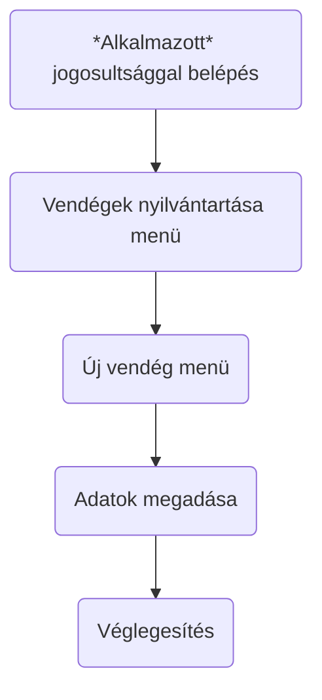

Vendégek adatainak módosítása
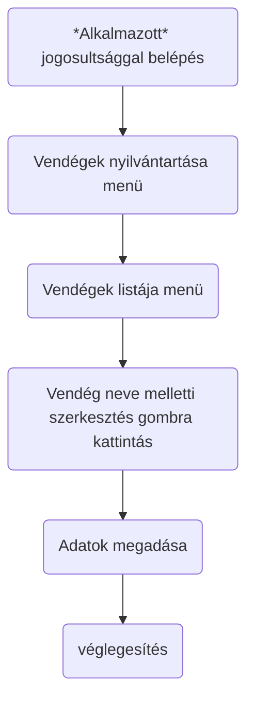

Vendégek adatainak módosítása 2.
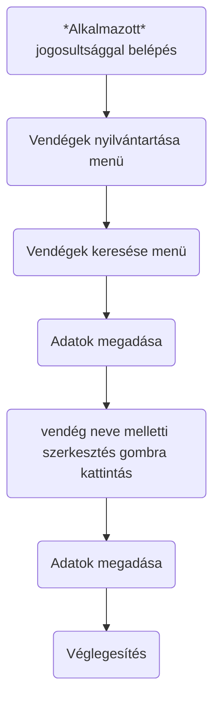

Vendégek adatainak törlése
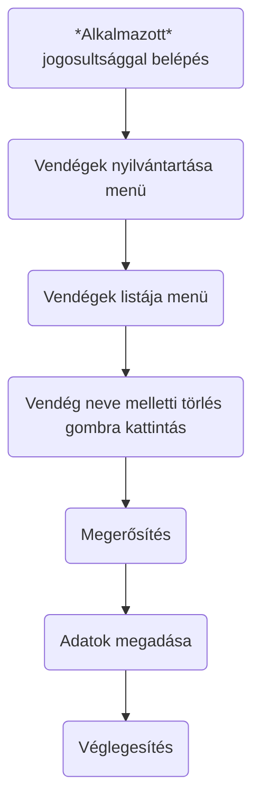

Vendégek adatainak törlése 2.
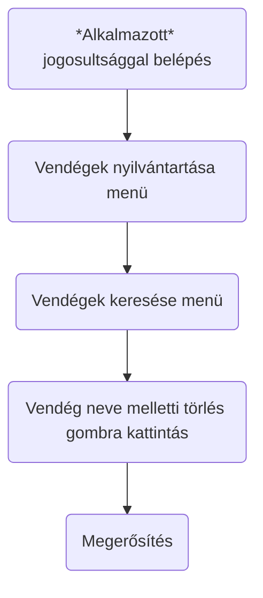

Vendégek adatainak böngészése
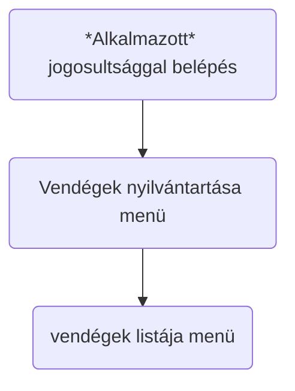

Vendégek adatainak böngészése kereséssel
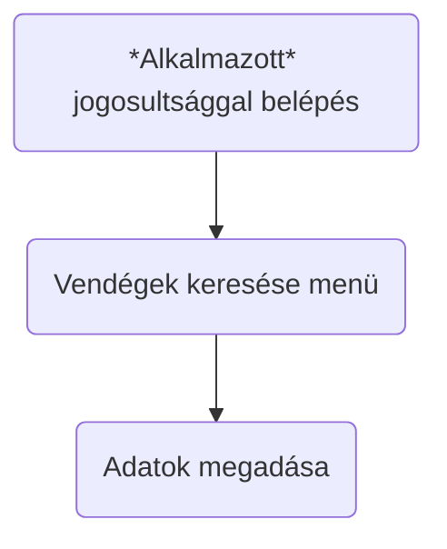

Új hír felvitele
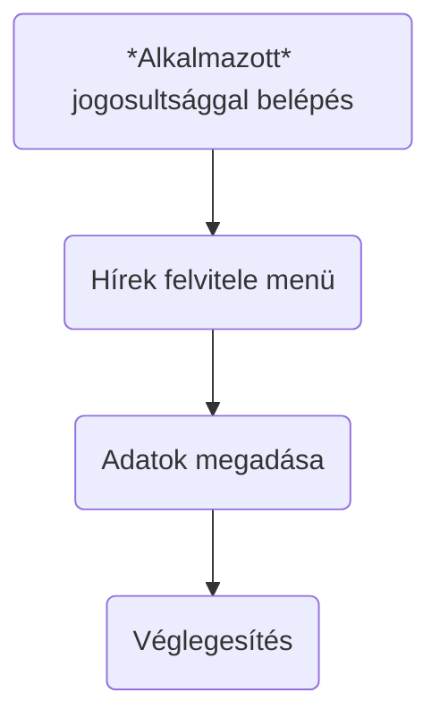

Hírek böngészése, szerkesztése
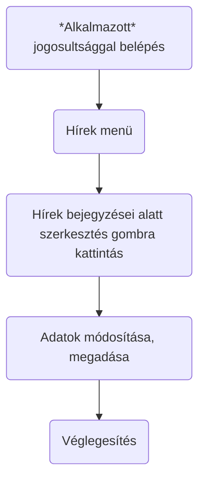

Hírek törlése
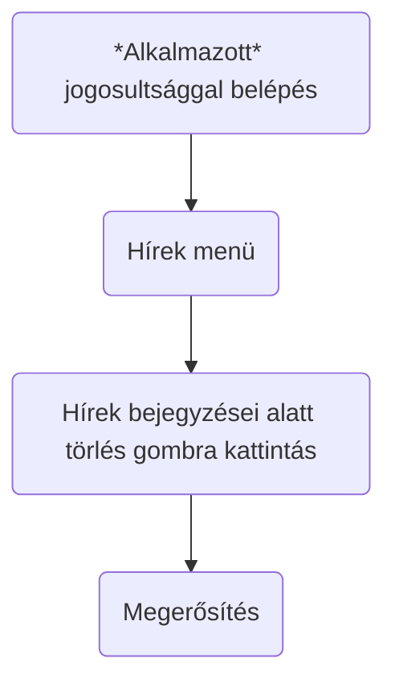

Online folyamatok adminisztrátorok számára:
Az adminisztrátorok minden menüpontot és funkciót elérhetnek, amit a vendégek. minden menüpontot és funkciót elérhetnek, amit a vendégek.

Új alkalmazott felvitele
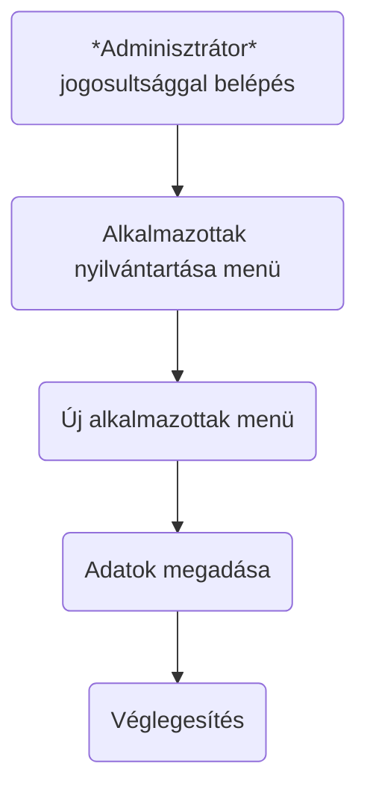

Alkalmazott adatainak módosítása
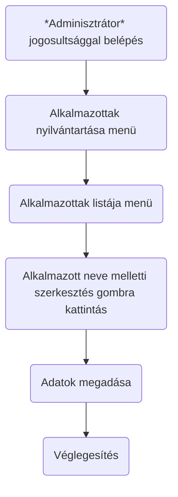

Alkalmazott adatainak módosítása 2.
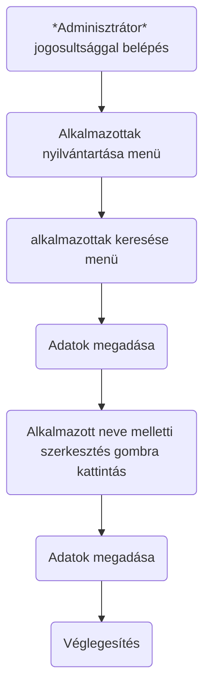

Alkalmazott adatainak törlése
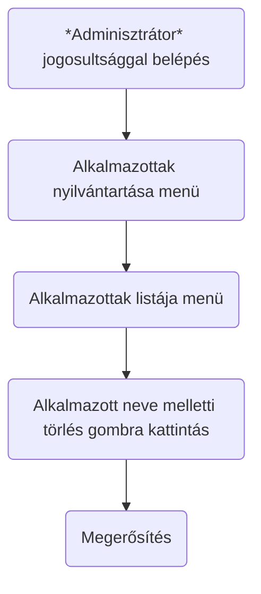

Alkalmazott adatainak törlése 2.
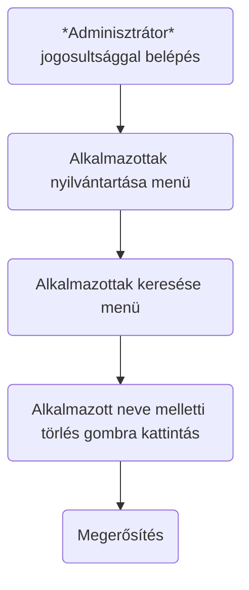

## 6. Követelménylista

Modul|ID|Verzió|Név|Kifejtés
-----|--|------|---|--------
Funkció|K01|V1.0|Kezdő weblaprész|A weblap teljes funkcionalitása csak azután érhető el, hogy a felhasználó regisztrál és bejelentkezik az oldalra.
Funkció|K02|V1.0|Bejelentkezési felület|A felhasználó az email címével és jelszavával tud bejelentkezni az oldalra. Amennyiben a megadott adatok hibásak, az oldal hibaüzenetet jelenít meg a felhasználó számára.
Funkció|K03|V1.0|Regisztrációs felület|A felhasználó a regisztráció során megadja a felhasználónevét, e-mail címét és jelszavát melyet az adatbázisban eltárol.
Funkció|K04|V1.0|Jogosultsági szintek|- Alkalmazott : Videó/kép feltöltés, blogok létrehozása, edzéstervek létrehozása... - Felhasználó : Bérlet vásárlás, edzéstervek megtekintése, edző fogadása...
Funkció|K05|V1.0|Jogosultsági felület létrehozása|Itt lehet a tagok egyébb jogosultságait módosítani az adatbázisban
Funkció|K06|V1.0|Videók|Itt lehet a weboldalra videót feltölteni
Funkció|K07|V1.0|Galéria|Itt lehet a weboldalra képeket feltölteni
Funkció|K08|V1.0|Szöveg|Itt lehet a weblapra a különböző szöveg típusú tartalom hozzáadása
Funkció|K09|V1.0|Árlista|Különböző bérleti dijak közül lehet választani
Funkció|K10|V1.0|Edzéstervek, egyébb tartalom|Edzéstervek és egyébb tartalom közül lehet böngészni

## 7. Irányított és szabad szöveges riportok szövege 

A megrendelői igény a tárgyalás útján lett felmérve.

## 8. Fogalomtár
