## 1. Rendszer célja
## 2.Projektterv
### 2.1 Projektszerepkörök, felelőségek

Scrum master: Schmidt György

Product owner: Horváth Dávid

Üzleti szereplők:
 - Megrendelő: Kiss János edzőterem tulajdonos.

### 2.2 Projektmunkások és felelőségeik

Frontend: (Feladatuk weboldal kinézetének az elkészítése, illetve a megrendelő által igényelt funkciók megvalósítása)
- Horváth Dávid 
- Schmidt György

Backend: (Feladatuk az adatbázis kialakítása illetve abból az adatok kiszolgálása a frontend számára)
- Vas Ádám
- Lecza Tamás Zoltán
	
Tesztelés:
- Horváth Dávid 
- Schmidt György
- Vas Ádám
- Lecza Tamás Zoltán
	
### 2.3 Ütemterv

||Funkció / Story | Feladat / Task | Prioritás | Becslés | Aktuális becslés | Elteltidő | Hátralévő idő ||
|-|---------------|----------------|-----------|---------|------------------|-----------|---------------|-|
||Követelmény specifikáció|        |         0 |      12 |               12 |        12 |             0 ||             
||Funkcionális specifikáció|       |         0 |      12 |               12 |        12 |             0 ||
||Rendszerterv|                    |           |      20 |               20 |        16 |             4 ||
||Adattárolás|Adatmodell megtervezése|       0 |       4 |                4 |         4 |             0 ||
||Adattárolás|Adatbázis megvalósítása a szerveren|  1 |  	  2 |                2 |         0 |             2 ||
||Backend|Route & controllers elkészítése|        	2 |      16 |               16 |         0 |            16 ||
||Backend|Adatbázis kapcsolat megvalósítása|        2 |      12 |               12 |         0 |            12 ||
||Backend|Adatfeladolgozó funkciók megvalósítása|   2 |      12 |               12 |         0 |            12 ||
||Website|Képernyőtervek elkészítése|        		2 |       8 |                8 |         0 |             8 ||
||Website|Prototípus elkészítése|            		2 |       8 |                8 |         0 |             8 ||
||Website|Adatbázis létrehozása|             		2 |       8 |                8 |         0 |             8 ||
||Website|Menüstruktúra elkészítése|         		2 |       8 |                8 |         0 |             8 ||
||Website|Kezdőlap funkciók elkészítése|      		2 |       8 |                8 |         0 |             8 ||
||Website|Felhasználói felület elkészítése|      	2 |       8 |                8 |         0 |             8 ||
||Website|Alkalmazottak felület elkészítése|      	2 |       8 |                8 |         0 |             8 ||
||Website|Adminisztrátori felület elkészítése|      2 |       8 |                8 |         0 |             8 ||
||Website|Tesztelés|                         		2 |      16 |               16 |         0 |            16 ||

### 2.4 Mérföldkövek

- A prototipus bemutatása
- Az elkészült szoftver átadása 

## 3 Üzleti folyamatok modellje

### 3.1 Üzleti szereplők

A weboldalt azon sportolók használhatják ingyenesen, akik a megrendelő által üzemeltetett fittnesz terembe
érvényes bérlete van. Azoknak, akiknek nincs érvényes bérlete azoknak fizetni kell, ha meg szeretnék tekinteni a weboldal tartalmát.

### 3.2 Üzleti folyamatok
Regisztráció nélkül a bejelentkező olal elérése biztosított. Regisztrált felhasználó lehet normál felhasználó és lehet admin jogosult is. Adminisztrátor jogosult fel tud tölteni file okat a normál felhasználóval ellentétben. 
Tobábbá regisztrációhoz, felhasználók kezeléséhez is szükséges az admin jogosultság.
A weboldalra való belépés egy klasszikus login funkción keresztül történik. Szükséges egy felhasználónév illetve egy jelszó megadása.
Amennyiben ez sikeres akkor, a felhasználó belép a weboldalra ellenkező esetben a belépés sikertelen. Sikertelen bejelentkezést hibaüzenet követ.
A bejelentkezés minden felhasználó számára azonos helyen érhető el. 
A belépés után megjelenik a weboldal tartalma ahol a felhasználó megtekintheti a kívánt tartalmat.
Bejelentkezést követően a jogosultságoknak megfelelően jelenik meg a menürendszer. 

Azon felhasználók (dolgozók), akiknek van jogosultsága új tagot regisztrálni az adatbázisba annak egy bővitett funkcióval ellátott oldal jelenik meg.

Felhasználó regisztrációja a rendszerben:

Regisztrációhoz szükséges adatok:

||User||
|-|---------|-|
||User_Szem_Szam||
||User_Csalad_Nev||
||User_Utonev||
||User_Utonev2||
||User_Szul_Ido||
||User_Felhasznalo_nev||
||E-mail||
||Jelszo||
||Reg_Datum||
||User_Role||

Szöveges tartalom tárolásához szükséges adatok:

||Szoveg||
|-|---------|-|
||idSzoveg||
||Szoveg_cim||
||Tartalom||
||Szoveg_feltolt_ideje||
||User_idUser||

Kép tartalom tárolásához szükséges adatok:

||Kep||
|-|---------|-|
||idKep||
||Kepnev||
||Kep_Feltoltes_Ideje||
||User_idUser||
||Szoveg_idSzoveg||

Videó tartalom tárolásához szükséges adatok:

||Video||
|-|---------|-|
||idVideo||
||Videonev||
||Video_Feltoltes_Ideje||
||Video_link||
||User_idUser||
||Szoveg_idSzoveg||

Új vendég felvitele
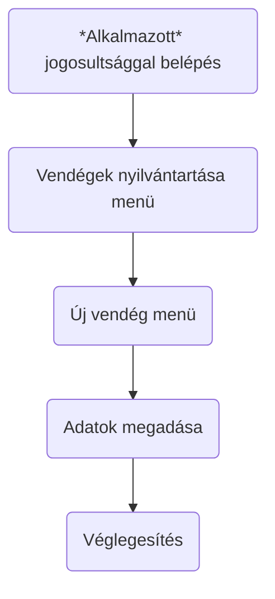

Vendégek adatainak módosítása
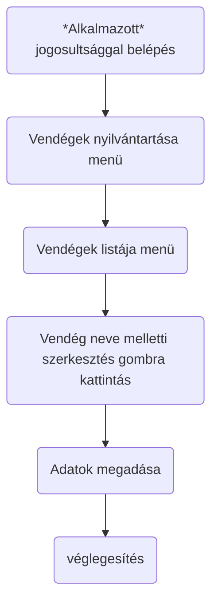

Vendégek adatainak módosítása 2.
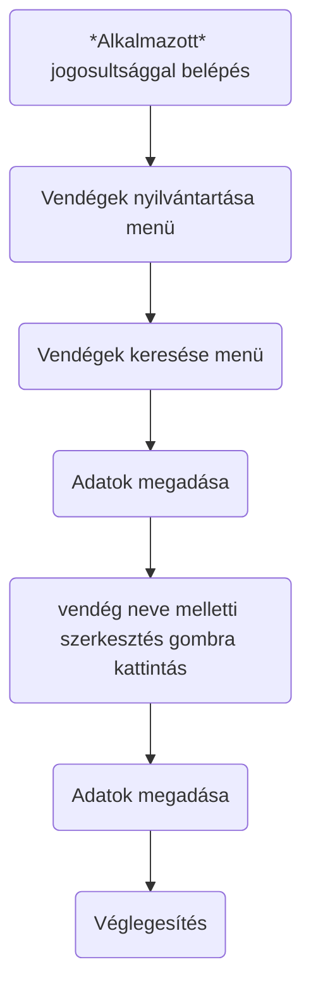

Vendégek adatainak törlése
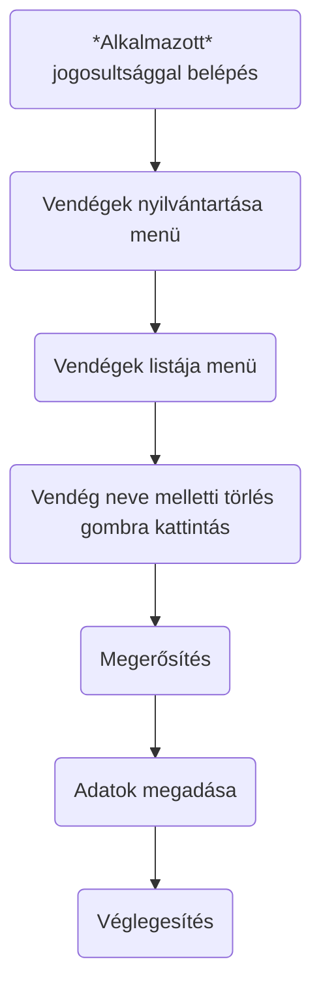

Vendégek adatainak törlése 2.
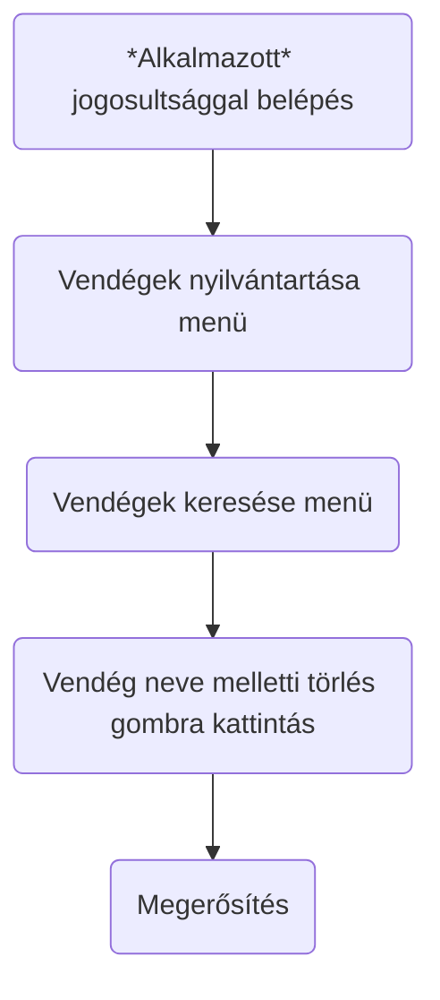

Vendégek adatainak böngészése
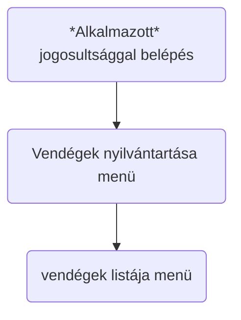

Vendégek adatainak böngészése kereséssel
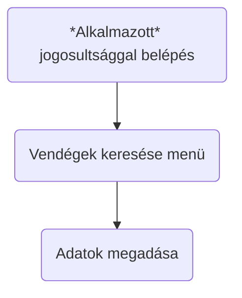

Új hír felvitele
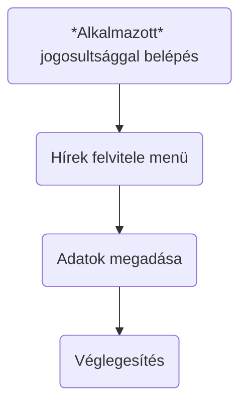

Hírek böngészése, szerkesztése
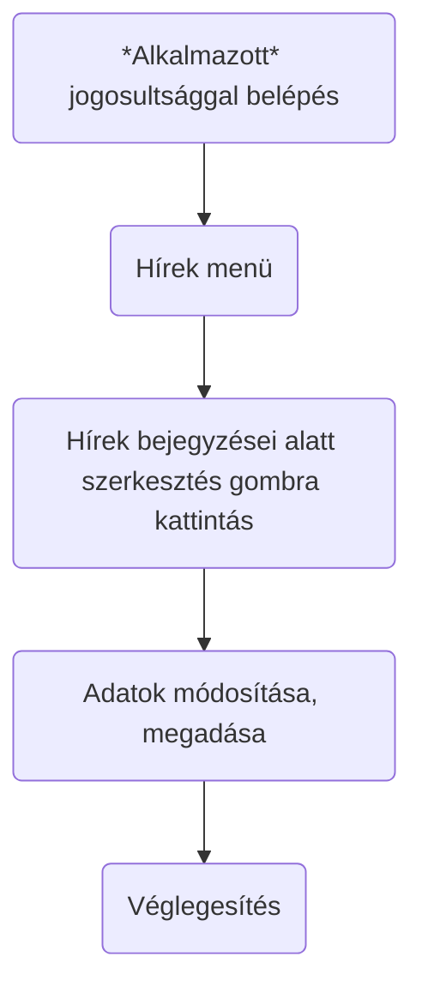

Hírek törlése
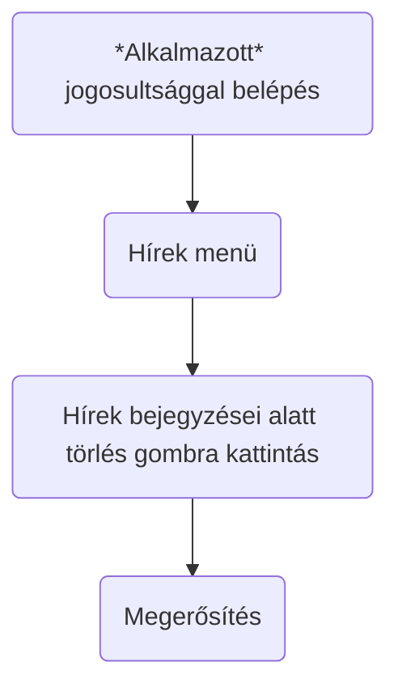

Online folyamatok adminisztrátorok számára:
Az adminisztrátorok minden menüpontot és funkciót elérhetnek, amit a vendégek. minden menüpontot és funkciót elérhetnek, amit a vendégek.

Új alkalmazott felvitele
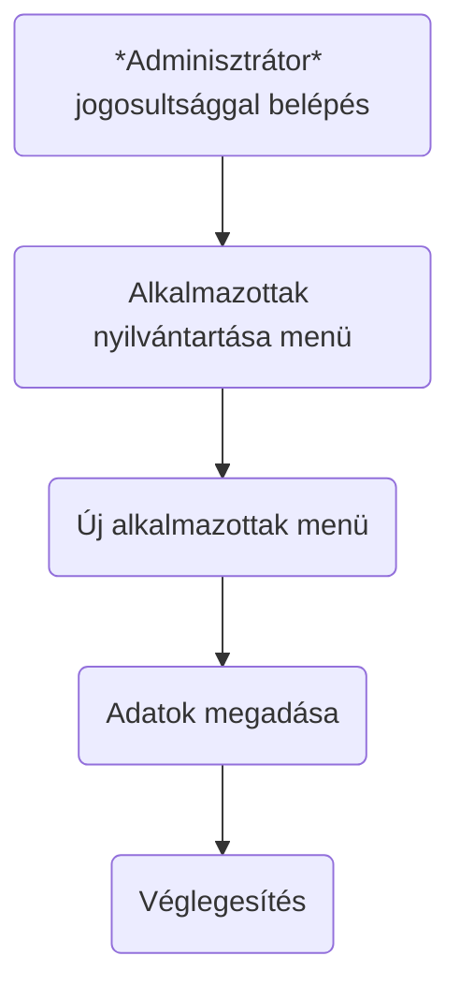

Alkalmazott adatainak módosítása
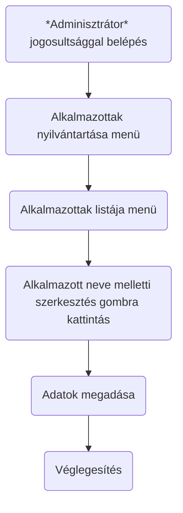

Alkalmazott adatainak módosítása 2.
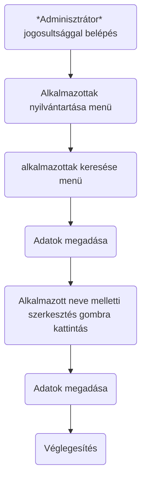

Alkalmazott adatainak törlése
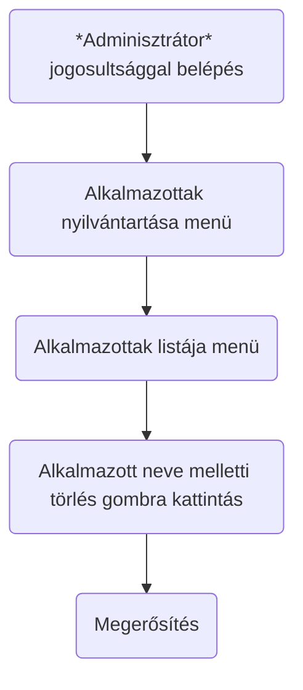

Alkalmazott adatainak törlése 2.
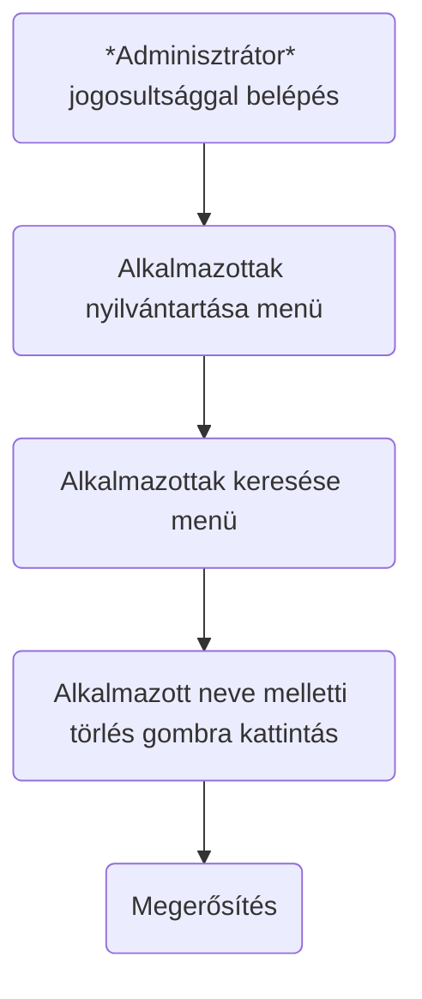
## 4. Követelmények

### 4.1 Funkcionális követelmények  

### 4.2 Nemfunkcionális követelmények  

## 5 Funkcionális Terv

### 5.1 Rendszer szereplői

A rendszerben két nagyobb csoport van jelen. Az egyik a bérlettel rendelkezők sportolók csoportja, a másik az adminisztrációt végzők csoportja. 
A sportolók igénybe veszik az edzőterem illetve a weboldal szolgáltatásait, a dolgozók a sportoló adatait regisztrálják, módosítják és törlik.
A rendszergazdai jogosultsággal rendelkezők új dolgozót képesek felvinni a rendszerbe, módosítani az eltárolt adatokat illetve törölni azokat.
Kezdetben a rendszergazda és a tulajdonos teljeskörű jogosultságot kapnak, amit később a tulajdonos módosíthat, tehát lesz olyan dolgozó aki szintnén adminisztrátori
jogosultságot fog kapni. 

### 5.2 Rendszerhasználati esetek

### 5.3 Menühiearchiák
A weboldal bejelentkezés nélkül 4 menü lesz elérhető. Főoldal, kapcsolat, bejelentkezés, regisztráció. 
A rendszerbe való bejelentkezés után lesz látható a felhasználó által használható menürendszer.
A menüben 10 db gomb lesz kialakítva amelyre rákattintás után eltérő tartalom lesz megjelenítve. A menürendszer úgy lesz kialakítva, hogy 
a felhasználó annyi gombot fog látni amilyen jogköre van.
A rendszerünkben 3 jogkör lesz. 
-**Felhasználói jogkörrel rendelkező** Az a felhasználó aki csak felhasználói jogkörrel rendelkezik, azok a 10 menüpontból
csak 9-et fog elérni amelyek a következők: Főoldal,Galéria,Videók,Árlista,Étrendek,Edzéstervek,Hírek,Kapcsolat,Kijelentkezés. 
-**Dolgozói jogkörrel rendelkező** Dolgozói jogkörrel rendelkező személynek meg fog jelenni az előzőekben felsorolt 9 menü amely ki
lesz egészítve felhasználó regisztrálása menü, ahol lehetőség lesz új sportoló hozzáadása, sportoló törlése , sportoló adatainak módosítása illetve
sportoló keresése funkciók. 
-**Adminisztrátori jogkörrel rendelkező** Adminisztrátori bejelentkezés után a weboldal teljes menürendszre lesz elérhető. Neki meg fog jelenni egy 
munkatárs crude gomb, amelyre rákattintva lehetősége lesz új munkatárs hozzáadaása, munkatárs törlése, munkatárs adatatinak a módosítása illetve munkatárs 
keresése funkció. 

## 6. Fizikai környezet
Fronend felületet React, a backend felületet NodeJS biztosítja.

### 6.1 Vásárolt softwarekomponensek és külső rendszerek
Nincsenek vásárolt szoftverkomponensek. 

### 6.2 Hardver és hálózati topológia
- Az alkalmazás web platformra készül.
- Internet böngészőn keresztül érhető el a felhasználó felület.
- Szerverhez interneten keresztül lehet csatlakozni.  
 
### 6.3 Fizikai alrendszerek
- Webszerver: 80-as porton elérhető HTTP szolgáltatás 
- MongoDB adatbázis szerver
- Kliens gépek: a követelményeknek megfelelő internet böngésző futtatására alkalmas PC-k.

### 6.4 Fejlesztő eszközök
- Visual Studio Code
- Notepad++

### 6.5 Keretrendszer
- React
## 9.Adatbázisterv

**Sportolo egyedet** jellemzi: 
 idSportolo, ez az elsődleges kulcs,  
 Szem_Szám, 
 Családnév,  
 Utónév, 
 Utónév2, 
 Születési_idő, 
 Felhasználó_név, 
 Jelszó, 
 E_mail, 
 Reg_Datum, 
 Dolgozó_idDolgozó, ami idegen kulcs, 

**Dolgozó egyedet** jellemzi: 
 idDolgozó, ez az elsődleges kulcs 
 Dolg_Szem_Szám, 
 Dolg_Család_Név, 
 Dolg_Utónév, 
 Dolg_Utónév2, 
 Dolg_Szül_Idő, 
 Dolg_Jog_Szint, 
 
**Szöveg** 
 idSzöveg, ez az elsődleges kulcs 
 Szöveg_cím, 
 Tartalom, 
 Szöveg_feltölt_ideje, 
 Dolgozó_idDolgozó, ami idegen kulcs 
 
**Kép** 
 idKép, ez az elsődleges kulcs, 
 Képnév, 
 Kép_link, 
 Kép_Feltöltési_Ideje, 
 Dolgozó_idDolgozó ez idegen kulcs 
 
**Videó** 
 Videonév, 
 Video_link, 
 Video_Feltöltés_Ideje 
 Dolgozó_idDolgozó, ez idegen kulcs 
 
 ### 9.1 Logikai Adatmodell
 **Egyed-kapcsolat diagramm**
 
 
 
 **Adatbázis séma**
 
 
